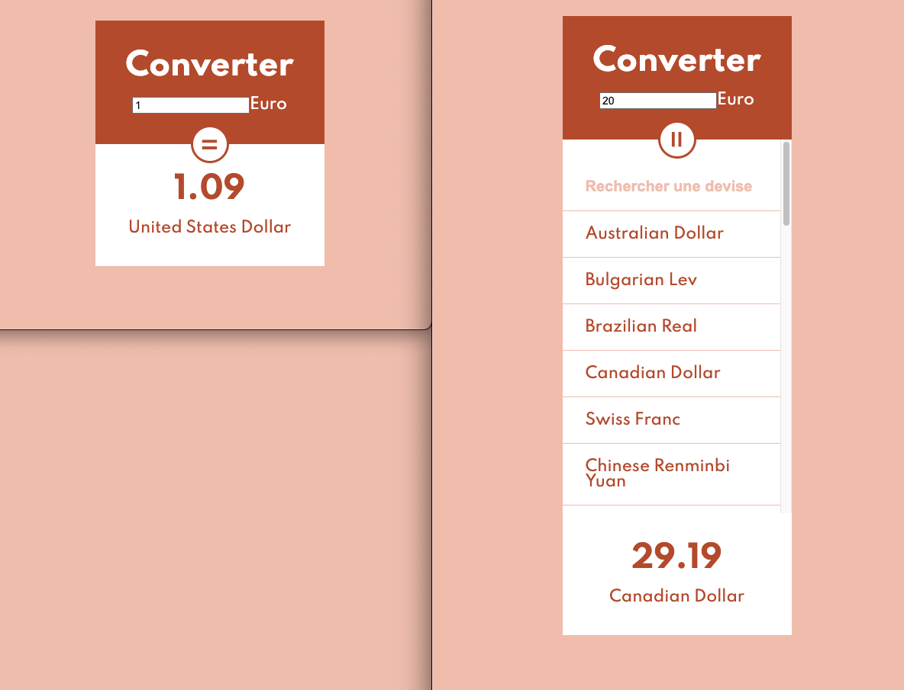

# :euro: :dollar: Currency Converter

## Create a converter using the fundamental structure of a React project.

## Illustration

## Language
- HTML5
- CSS3/SCSS
- javascript/REACT
- JSX

## Goals 
- Fundamentals (Javascript)
- Virtual DOM / LifeCycles (componentDidMount & componentDidUpdate)
- Components / controlled components
- Props
- Staleless and Stateful components
- Dynamize with data

## Status
Project completed

## Context
Project carried out during my training as a web developer